# DDD E-Commerce Backend — Architecture & Documentation

A production-grade, distributed e-commerce backend built with **Domain-Driven Design (DDD)**, **Onion Architecture**, **CQRS**, and the **Transactional Outbox Pattern**. Each process runs as an isolated unit with its own Composition Root (manual DI container) and entry point.

**Repo:** [github.com/djaouad10/DDD-E-commerce-Backend](https://github.com/djaouad10/DDD-E-commerce-Backend)
**Blog post:** [Dependency Injection from Scratch — Building a DI Container for a DDD TypeScript Backend](https://www.djaouadgharbi.tech/blog/dependency-injection-from-scratch)

> **A note on file links:** the paths below are derived from the `#/...` import aliases and snippets in the project. Where a path is inferred rather than copied verbatim, it is still the canonical location the codebase uses for that concept.

---

## Table of Contents

1. [High-Level Overview](#1-high-level-overview)
2. [Distributed Topology](#2-distributed-topology)
3. [Onion Architecture Layers](#3-onion-architecture-layers)
4. [Process Architecture & Composition Roots](#4-process-architecture--composition-roots)
5. [The HTTP Layer (API)](#5-the-http-layer-api)
6. [The Messaging Layer (BullMQ Workers)](#6-the-messaging-layer-bullmq-workers)
7. [The Cron Workers](#7-the-cron-workers)
8. [The Transactional Outbox Pattern](#8-the-transactional-outbox-pattern)
9. [Domain Events & Event Publishing](#9-domain-events--event-publishing)
10. [Idempotency & At-Least-Once Delivery](#10-idempotency--at-least-once-delivery)
11. [Concurrency Control (Optimistic Locking)](#11-concurrency-control-optimistic-locking)
12. [Error Handling Strategy](#12-error-handling-strategy)
13. [Observability: Logging & Context Propagation](#13-observability-logging--context-propagation)
14. [Persistence & Read Models](#14-persistence--read-models)
15. [Testing Strategy](#15-testing-strategy)
16. [CI/CD Pipeline](#16-cicd-pipeline)
17. [Diagrams](#17-diagrams)

---

## 1. High-Level Overview

This backend powers an e-commerce platform (products, cart, orders, ratings, users) with a heavy focus on:

- **Correctness under concurrency**: optimistic locking, idempotency keys, and transactional outbox.
- **Reliable external integrations**: a shipping provider API (World Express) is never called inside a DB transaction; instead, outbox jobs schedule those calls.
- **Distributed processing**: a single Docker image runs as 7 different processes (1 API + 6 workers), each with its own DI container.
- **Testability**: in-memory adapters for unit tests, real Postgres + fake gateways for integration tests, and per-endpoint integration tests.

The DI container and composition-root design are documented in detail in the companion blog post: [*Dependency Injection from Scratch*](https://www.djaouadgharbi.tech/blog/dependency-injection-from-scratch).

**Tech stack**

| Concern            | Choice                             |
| ------------------ | ---------------------------------- |
| Language / Runtime | TypeScript / Node.js 22            |
| HTTP               | Express                            |
| DB                 | PostgreSQL + Drizzle ORM           |
| Queue / Cache      | Redis + BullMQ                     |
| Auth               | Better Auth                        |
| File Uploads       | UploadThing                        |
| Email              | Brevo                              |
| Validation         | Zod                                |
| Test               | vitest + Supertest                 |
| Container          | Docker (single image, 7 processes) |
| Registry           | GHCR                               |
| CI/CD              | GitHub Actions                     |

---

## 2. Distributed Topology

The system is deployed as **one Docker image** (`ghcr.io/djaouad10/ddd-e-commerce-backend:latest`) running as **seven independent processes**, each with its own command:

```
┌──────────────────────────────────────────────────────────────────────┐
│                     Single Docker Image                              │
│                                                                      │
│  api                       → entrypoints/api/index.js                │
│  outbox-handler            → entrypoints/workers/outbox-handler.js   │
│  email-queue-handler       → entrypoints/workers/email-queue-handler │
│  outbox-processor          → workers/outbox-processor.js             │
│  domain-events-processor   → workers/domain-events-processor.js      │
│  clean-outbox              → workers/clean-outbox.js                 │
│  reset-stuck-outbox        → workers/reset-stuck-outbox-rows.js      │
└──────────────────────────────────────────────────────────────────────┘
```

Each process:

- Has its **own Composition Root** (`buildXContainer()`).
- Has its **own entry point** (a `bootstrap()` function or a `start()` call).
- Registers **only the objects it needs** to build its object graph at runtime.
- Shares infrastructure adapters (Postgres, Redis) via [`registerSharedInfrastructure()`](https://github.com/djaouad10/DDD-E-commerce-Backend/blob/main/src/composition/utils/shared-registry.ts).

This is the essence of **"one deployable, many processes"**, a modular monolith packaged as a distributed system. The blog post calls this out in [Part V — Composition Roots and the Object Graph Per Process](https://www.djaouadgharbi.tech/blog/dependency-injection-from-scratch#part-v-composition-roots-and-the-object-graph-per-process).

The orchestrator is [`docker-compose.yml`](https://github.com/djaouad10/DDD-E-commerce-Backend/blob/main/docker-compose.yml), which defines the seven services with a shared `x-service-defaults` anchor.

Entry points:

- API: [`src/entrypoints/api/index.ts`](https://github.com/djaouad10/DDD-E-commerce-Backend/blob/main/src/entrypoints/api/index.ts)
- [`src/entrypoints/workers/outbox-handler.ts`](https://github.com/djaouad10/DDD-E-commerce-Backend/blob/main/src/entrypoints/workers/outbox-handler.ts)
- [`src/entrypoints/workers/email-queue-handler.ts`](https://github.com/djaouad10/DDD-E-commerce-Backend/blob/main/src/entrypoints/workers/email-queue-handler.ts)
- [`src/entrypoints/workers/outbox-processor.ts`](https://github.com/djaouad10/DDD-E-commerce-Backend/blob/main/src/entrypoints/workers/outbox-processor.ts)
- [`src/entrypoints/workers/domain-events-processor.ts`](https://github.com/djaouad10/DDD-E-commerce-Backend/blob/main/src/entrypoints/workers/domain-events-processor.ts)
- [`src/entrypoints/workers/clean-outbox.ts`](https://github.com/djaouad10/DDD-E-commerce-Backend/blob/main/src/entrypoints/workers/clean-outbox.ts)
- [`src/entrypoints/workers/reset-stuck-outbox-rows.ts`](https://github.com/djaouad10/DDD-E-commerce-Backend/blob/main/src/entrypoints/workers/reset-stuck-outbox-rows.ts)

**Diagram:**

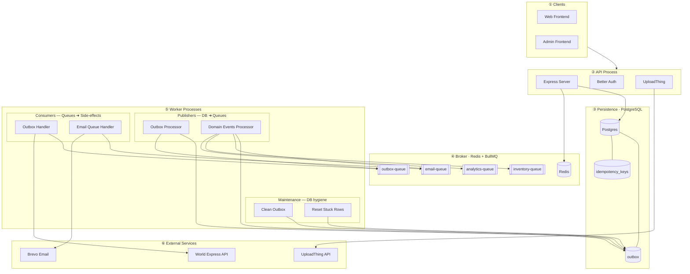


---

## 3. Onion Architecture Layers

```
        ┌────────────────────────────────────────────┐
        │              INFRASTRUCTURE                │
        │  (Express, BullMQ, Drizzle, Postgres,      │
        │   Brevo, WorldExpress gateway, mappers,    │
        │   HTTP client, repositories/read-models    │
		│   implementations)                         │
        │                                            │
        │   ┌────────────────────────────────────┐   │
        │   │           APPLICATION              │   │
        │   │  (Services, Commands, Queries,     │   │
        │   │   DTOs, Application Ports,         │   │
        │   │   Read-Model contracts)            │   │
        │   │                                    │   │
        │   │   ┌────────────────────────────┐   │   │
        │   │   │         DOMAIN             │   │   │
        │   │   │  (Entities, Value Objects, │   │   │
        │   │   │   Domain Events, Domain    │   │   │
        │   │   │   Services, Repository &   │   │   │
        │   │   │   Gateway ports in domain  │   │   │
        │   │   │   language, Domain errors) │   │   │
        │   │   └────────────────────────────┘   │   │
        │   └────────────────────────────────────┘   │
        └────────────────────────────────────────────┘
```

**Dependency rule:** inner layers know nothing about outer layers.

| Layer | Depends on | Knows about |
|---|---|---|
| Domain | Nothing | Itself |
| Application | Domain | Domain classes, types, errors, contracts |
| Infrastructure | Domain + Application | Everything |

**Key design choices**

- **Repository & gateway ports live in the domain** when they accept/return aggregates ([`src/domain/repositories/order.repository.ts`](https://github.com/djaouad10/DDD-E-commerce-Backend/blob/main/src/domain/repositories/order.repository.ts), [`src/domain/gateways/shipping-provider.gateway.ts`](https://github.com/djaouad10/DDD-E-commerce-Backend/blob/main/src/domain/gateways/shipping-provider.gateway.ts)).
- **Application-owned ports live in the application layer** when they exist to support technical workflows ([`src/application/ports/persistence/outbox.repository.port.ts`](https://github.com/djaouad10/DDD-E-commerce-Backend/blob/main/src/application/ports/persistence/outbox.repository.port.ts), [`src/application/ports/persistence/idempotency-keys.repository.port.ts`](https://github.com/djaouad10/DDD-E-commerce-Backend/blob/main/src/application/ports/persistence/idempotency-keys.repository.port.ts), [`src/application/ports/messaging/event-publisher.port.ts`](https://github.com/djaouad10/DDD-E-commerce-Backend/blob/main/src/application/ports/messaging/event-publisher.port.ts)), they never accept or return domain aggregates.
- **Read-model contracts** ([`src/application/read-models/order.queries.ts`](https://github.com/djaouad10/DDD-E-commerce-Backend/blob/main/src/application/read-models/order.queries.ts), [`product.queries.ts`](https://github.com/djaouad10/DDD-E-commerce-Backend/blob/main/src/application/read-models/product.queries.ts), [`rating.queries.ts`](https://github.com/djaouad10/DDD-E-commerce-Backend/blob/main/src/application/read-models/rating.queries.ts)) are defined in the application layer and return DTOs tailored for specific consumers.

The "who owns the abstraction" rule is expanded in the blog post: [§5.4 Who owns the abstraction](https://www.djaouadgharbi.tech/blog/dependency-injection-from-scratch#54-who-owns-the-abstraction) and [§6.2 Ports and adapters](https://www.djaouadgharbi.tech/blog/dependency-injection-from-scratch#62-ports-and-adapters).

Representative domain classes:

- [`src/domain/entities/product.ts`](https://github.com/djaouad10/DDD-E-commerce-Backend/blob/main/src/domain/entities/product.ts)  the `Product` aggregate (with `recordThat`, `reserveStock`, `releaseStock`, …)
- [`src/domain/entities/order.ts`](https://github.com/djaouad10/DDD-E-commerce-Backend/blob/main/src/domain/entities/order.ts)
- [`src/domain/entities/user.ts`](https://github.com/djaouad10/DDD-E-commerce-Backend/blob/main/src/domain/entities/user.ts)
- [`src/domain/value-objects/money.ts`](https://github.com/djaouad10/DDD-E-commerce-Backend/blob/main/src/domain/value-objects/money.ts)
- [`src/domain/value-objects/order-id.ts`](https://github.com/djaouad10/DDD-E-commerce-Backend/blob/main/src/domain/value-objects/order-id.ts)
- [`src/domain/value-objects/shipping-details.ts`](https://github.com/djaouad10/DDD-E-commerce-Backend/blob/main/src/domain/value-objects/shipping-details.ts)
- [`src/domain/events/domain-event.ts`](https://github.com/djaouad10/DDD-E-commerce-Backend/blob/main/src/domain/events/domain-event.ts)  the `DomainEventCode` union
- [`src/domain/events/order/order-created.ts`](https://github.com/djaouad10/DDD-E-commerce-Backend/blob/main/src/domain/events/order/order-created.ts)
- [`src/domain/events/product/variation-created.ts`](https://github.com/djaouad10/DDD-E-commerce-Backend/blob/main/src/domain/events/product/variation-created.ts)

**Diagram:**


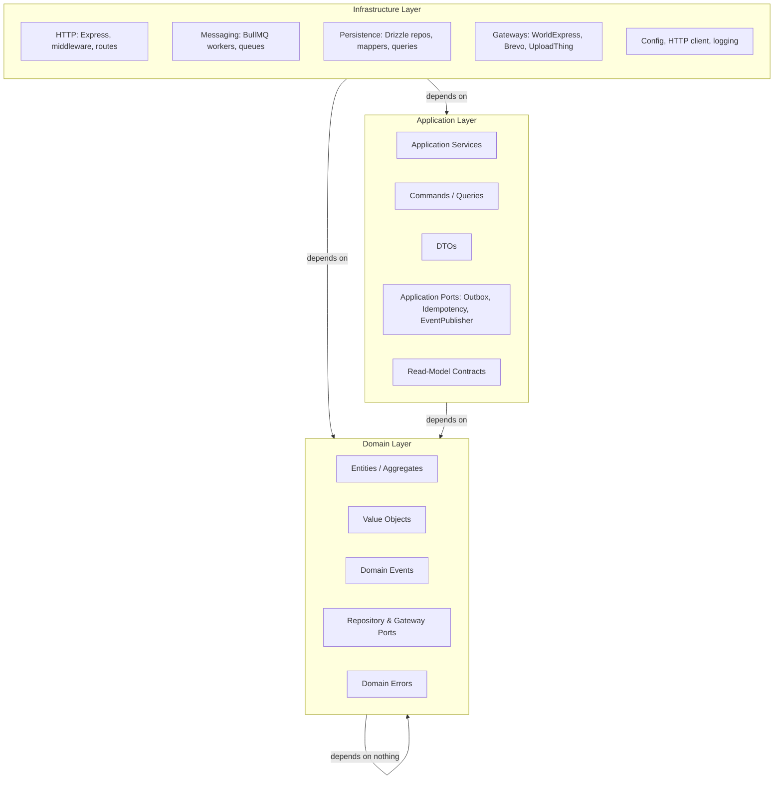


---

## 4. Process Architecture & Composition Roots

### The manual DI container

Instead of a package, a **hand-rolled DI container** with:

- **Tokens** (typed symbols/strings) for each resolvable.
- **Lifetimes**: `singleton`, `scoped`, `transient`.
- **Scopes**: `container.createScope()` for per-request / per-job / per-poll-cycle isolation.
- **Disposal**: `scope.dispose()` runs cleanup.

The full design, in four iterations, is in the blog post: [Part IV — Building the Container in Four Iterations](https://www.djaouadgharbi.tech/blog/dependency-injection-from-scratch#part-iv-building-the-container-in-four-iterations).

Files:

- [`src/composition/utils/container.ts`](https://github.com/djaouad10/DDD-E-commerce-Backend/blob/main/src/composition/utils/container.ts)
- [`src/composition/utils/tokens.ts`](https://github.com/djaouad10/DDD-E-commerce-Backend/blob/main/src/composition/utils/tokens.ts)
- [`src/composition/utils/shared-registry.ts`](https://github.com/djaouad10/DDD-E-commerce-Backend/blob/main/src/composition/utils/shared-registry.ts)

Registration example ([`src/composition/roots/outbox-processor.composition.ts`](https://github.com/djaouad10/DDD-E-commerce-Backend/blob/main/src/composition/roots/outbox-processor.composition.ts), also the "smallest root, in full" in the blog post [§15.1](https://www.djaouadgharbi.tech/blog/dependency-injection-from-scratch#151-the-smallest-root-in-full)):

```ts
export function buildOutboxProcessorContainer(): Container {
  const container = new Container();
  registerSharedInfrastructure(container);

  container.register(OUTBOX_QUEUE, (scope) => createBullMqOutboxQueue(scope.resolve(REDIS)), "singleton");

  container.register(OUTBOX_REPOSITORY, (scope) => new PostgresOutboxRepository(scope.resolve(DRIZZLE_DB)), "singleton");

  container.register(OUTBOX_PROCESSOR_SERVICE,
    (scope) => new OutboxProcessorService(
      scope.resolve(OUTBOX_REPOSITORY),
      scope.resolve(OUTBOX_QUEUE),
    ), "scoped");

  return container;
}
```

### Composition roots

| Root | Used by |
|---|---|
| [`buildApiContainer`](https://github.com/djaouad10/DDD-E-commerce-Backend/blob/main/src/composition/roots/api.composition.ts) | API process |
| [`buildOutboxHandlerContainer`](https://github.com/djaouad10/DDD-E-commerce-Backend/blob/main/src/composition/roots/outbox-handler.composition.ts) | outbox-handler worker |
| [`buildEmailQueueHandlerContainer`](https://github.com/djaouad10/DDD-E-commerce-Backend/blob/main/src/composition/roots/email-queue-handler.composition.ts) | email-queue-handler worker |
| [`buildOutboxProcessorContainer`](https://github.com/djaouad10/DDD-E-commerce-Backend/blob/main/src/composition/roots/outbox-processor.composition.ts) | outbox-processor worker |
| [`buildDomainEventsProcessorContainer`](https://github.com/djaouad10/DDD-E-commerce-Backend/blob/main/src/composition/roots/domain-events-processor.composition.ts) | domain-events-processor worker |
| [`buildCleanOutboxContainer`](https://github.com/djaouad10/DDD-E-commerce-Backend/blob/main/src/composition/roots/clean-outbox-worker.composition.ts) | clean-outbox worker |
| [`buildResetStuckOutboxRowsWorkerContainer`](https://github.com/djaouad10/DDD-E-commerce-Backend/blob/main/src/composition/roots/reset-stuck-outbox-rows-worker.composition.ts) | reset-stuck-outbox-rows worker |
| Integration-test containers | Real DB + fake auth/gateways (or real gateways overridden per test) |
| Unit-test containers | In-memory gateways & repositories |

Each root only pulls in what its process needs, keeping startup fast and dependency graphs minimal. The blog post walks through the full roster in [§15 My composition roots](https://www.djaouadgharbi.tech/blog/dependency-injection-from-scratch#15-my-composition-roots).

**Diagram:**

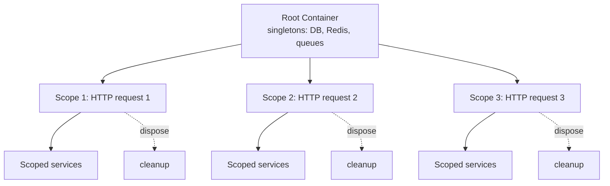


---

## 5. The HTTP Layer (API)

[`createServer(container)`](https://github.com/djaouad10/DDD-E-commerce-Backend/blob/main/src/infrastructure/http/server/index.ts) builds the Express app with a strict middleware order:

```
request
  │
  ├─ express.json()
  ├─ cors()
  ├─ /api/auth/*          → Better Auth handler
  ├─ /api/uploadthing     → UploadThing route handler
  ├─ requestTimerMiddleware
  ├─ scopeMiddleware(container)   ← creates req.scope, disposes on finish
  ├─ attachUserMiddleware         ← resolves AUTH, gets session, sets req.user
  ├─ contextMiddleware            ← AsyncLocalStorage (requestId, userId, ...)
  ├─ requestLogger
  ├─ /api/v1 → routes
  └─ errorHandlingMiddleware
```

**Per request:**

1. `scopeMiddleware` creates a **fresh DI scope**. Everything scoped (services, repositories, gateways) is disposed on `res.on("finish")`.
2. `contextMiddleware` seeds an `AsyncLocalStorage` context with `requestId`, `path`, `method`, `userId`, etc.
3. Each route parses `body`/`params`/`query` with a Zod schema, resolves the service from `req.scope`, builds a self-validating Command/Query, executes it, and returns the result.

Middleware files:

- [`src/infrastructure/http/middleware/request-timer-middleware.ts`](https://github.com/djaouad10/DDD-E-commerce-Backend/blob/main/src/infrastructure/http/middleware/request-timer-middleware.ts)
- [`src/infrastructure/http/middleware/scope-middleware.ts`](https://github.com/djaouad10/DDD-E-commerce-Backend/blob/main/src/infrastructure/http/middleware/scope-middleware.ts)  the "Scope per HTTP request" example in the blog post [§17](https://www.djaouadgharbi.tech/blog/dependency-injection-from-scratch#17-scope-per-http-request)
- [`src/infrastructure/http/middleware/attach-user-middleware.ts`](https://github.com/djaouad10/DDD-E-commerce-Backend/blob/main/src/infrastructure/http/middleware/attach-user-middleware.ts)
- [`src/infrastructure/http/middleware/context-middleware.ts`](https://github.com/djaouad10/DDD-E-commerce-Backend/blob/main/src/infrastructure/http/middleware/context-middleware.ts)
- [`src/infrastructure/http/middleware/request-logger-middleware.ts`](https://github.com/djaouad10/DDD-E-commerce-Backend/blob/main/src/infrastructure/http/middleware/request-logger-middleware.ts)
- [`src/infrastructure/http/middleware/error-handling-middleware.ts`](https://github.com/djaouad10/DDD-E-commerce-Backend/blob/main/src/infrastructure/http/middleware/error-handling-middleware.ts)
- Route table: [`src/infrastructure/http/routes/index.ts`](https://github.com/djaouad10/DDD-E-commerce-Backend/blob/main/src/infrastructure/http/routes/index.ts)

**Diagram:**

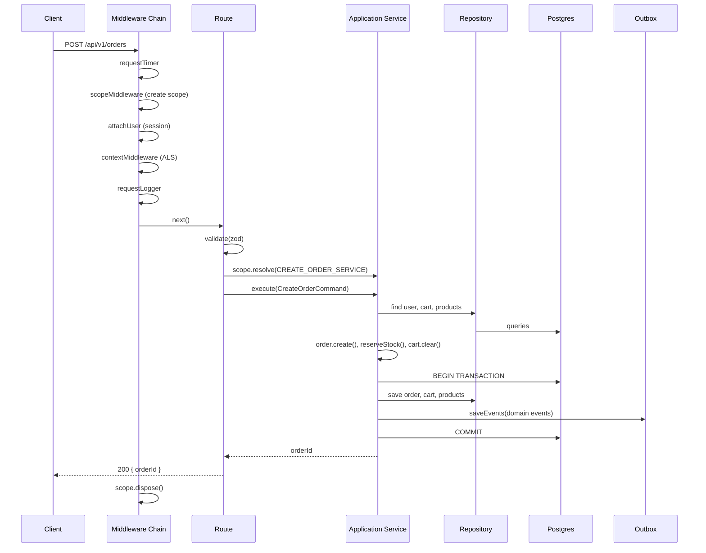


**Example route flow:**

```
POST /api/v1/orders
  → validate(createOrderBodySchema, req.body)
  → scope.resolve(CREATE_ORDER_SERVICE)
  → service.execute(new CreateOrderCommand(...))
  → returns { orderId }
```

**Error handling middleware** classifies errors into:

- **Operational** (`DomainError` subclasses) → warn-level logs, 4xx responses with user-friendly messages.
- **Programmer/infrastructure** (`DatabaseError`, `GatewayError`, `HttpTimeoutError`, …) → error-level logs with full stack trace, 500/502/504 responses.

Each error response includes the `requestId` so support tickets can be traced. See [`error-handling-middleware.ts`](https://github.com/djaouad10/DDD-E-commerce-Backend/blob/main/src/infrastructure/http/middleware/error-handling-middleware.ts).

---

## 6. The Messaging Layer (BullMQ Workers)

Two **job consumers** process queued work. Each pulls from a distinct BullMQ queue and uses a **registry pattern** to map job names → commands → services. The "scope per job" mechanics are in the blog post [§19 Scope per BullMQ job](https://www.djaouadgharbi.tech/blog/dependency-injection-from-scratch#19-scope-per-bullmq-job).

### [`OutboxHandlerWorker`](https://github.com/djaouad10/DDD-E-commerce-Backend/blob/main/src/infrastructure/messaging/bullmq/workers/outbox-handler.worker.ts) (queue: `outbox-queue`)

Handles **outbox jobs** (`create_order_in_shipping_api`, `delete_order_in_shipping_api`, `update_order_in_shipping_api`, `create_shipment_in_shipping_api`).

For every job:

1. Wrap in `runWithContext({ requestId: job_<id>, jobId, queueName })`.
2. Create a scope from the container.
3. Look up the payload schema by `job.name` and parse (Zod).
4. Build a typed command via `buildOutboxCommand(action, payload)`.
5. Resolve the service via a **typed registry** and execute it.
6. Dispose the scope.

Helpers: [`src/infrastructure/messaging/jobs/outbox-handler-utils.ts`](https://github.com/djaouad10/DDD-E-commerce-Backend/blob/main/src/infrastructure/messaging/jobs/outbox-handler-utils.ts) and payload schemas in [`src/infrastructure/messaging/jobs/validation.ts`](https://github.com/djaouad10/DDD-E-commerce-Backend/blob/main/src/infrastructure/messaging/jobs/validation.ts).

### [`EmailQueueHandlerWorker`](https://github.com/djaouad10/DDD-E-commerce-Backend/blob/main/src/infrastructure/messaging/bullmq/workers/email-queue-handler.worker.ts) (queue: `email-queue`)

Handles **domain events** routed to the email queue (`order.created`, `order.confirmed`, `order.cancelled`, `order.delivered`, `order.returned`, `rating.approved/rejected/submitted`, `user.registered`).

The pattern is identical, but the registry maps `DomainEventCode` → `EmailQueueEventToCommand` → `EmailQueueEventToService` → DI token, giving **fully typed end-to-end dispatch** with exhaustive `never` checks. See [`src/infrastructure/messaging/jobs/email-handler-utils.ts`](https://github.com/djaouad10/DDD-E-commerce-Backend/blob/main/src/infrastructure/messaging/jobs/email-handler-utils.ts).

Both workers set `concurrency: 3`, `lockDuration: 30000`, `stalledInterval: 30000`, and listen on `failed` / `stalled` for observability.

---

## 7. The Cron Workers

Four workers implement **in-process cron loops** (no external scheduler). Each extends the same shape (`running` flag + `AbortController` + `runIteration()` + `start()` + `stop()` + `loop()`).

| Worker | Interval | Purpose |
|---|---|---|
| [`OutboxProcessorWorker`](https://github.com/djaouad10/DDD-E-commerce-Backend/blob/main/src/infrastructure/messaging/bullmq/workers/outbox-processor.worker.ts) | 3 min | Claim PENDING outbox jobs → publish to `outbox-queue` |
| [`DomainEventsProcessorWorker`](https://github.com/djaouad10/DDD-E-commerce-Backend/blob/main/src/infrastructure/messaging/bullmq/workers/domain-events-processor.worker.ts) | 3 min | Claim PENDING domain events → fan out to email/inventory/analytics queues via `FlowProducer` |
| [`CleanOutboxWorker`](https://github.com/djaouad10/DDD-E-commerce-Backend/blob/main/src/infrastructure/messaging/bullmq/workers/clean-outbox.worker.ts) | 24 h | Delete `COMPLETED` rows older than 5 days |
| [`ResetStuckOutboxRowsWorker`](https://github.com/djaouad10/DDD-E-commerce-Backend/blob/main/src/infrastructure/messaging/bullmq/workers/reset-stuck-outbox-rows.worker.ts) | 3 h | Reset rows stuck in `PROCESSING` for >24h back to `PENDING` |

`runIteration()` is exposed directly so tests can call it without touching the infinite loop, the blog post describes this pattern in [§18 Scope per polling iteration](https://www.djaouadgharbi.tech/blog/dependency-injection-from-scratch#18-scope-per-polling-iteration).

Graceful shutdown is wired in every entry point:

```ts
process.on("SIGTERM", () => shutdown("SIGTERM"));
process.on("SIGINT",  () => shutdown("SIGINT"));
```

**Diagram:**

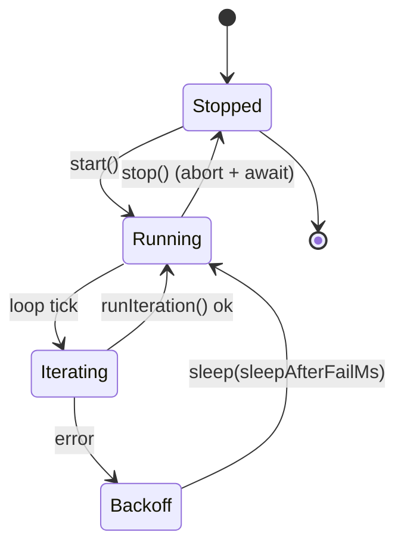


---

## 8. The Transactional Outbox Pattern

This is the **core reliability mechanism** of the system.

### The problem

An application service must atomically:

1. Persist the aggregate change (order, product, cart, …).
2. Emit a domain event.
3. Schedule an outbox job (e.g., "call the shipping API").

Calling the shipping API **inside** the DB transaction is unacceptable: if the HTTP call fails after the DB commit, you lose the side-effect; if it succeeds before commit, you may act on data that later rolls back.

### The solution

A single `outbox` table with two categories:

| `category` | `event_type` examples | Consumer |
|---|---|---|
| `outbox-job` | `create_order_in_shipping_api`, `delete_order_in_shipping_api`, … | `outbox-handler` |
| `domain-event` | `order.created`, `stock.reserved`, `cart.cleared`, … | `domain-events-processor` |

**Inside the same DB transaction as the aggregate save**, the service calls:

```ts
await this.db.transaction(async (tx) => {
  await this.idempotencyKeysRepository.create(idempotencyKey, "CreateOrderService", tx, { orderId });
  await Promise.all([
    this.orderRepository.save(order, tx),
    this.cartRepository.save(cart, tx),
    this.outboxRepository.saveEvents([...orderEvents, ...productEvents, ...cartEvents], tx),
  ]);
  await Promise.all(products.map(p => this.productRepository.save(p, tx)));
});
```

Outbox rows are **never published inside the transaction**. Publication is decoupled and idempotent.

Key files:

- Port: [`src/application/ports/persistence/outbox.repository.port.ts`](https://github.com/djaouad10/DDD-E-commerce-Backend/blob/main/src/application/ports/persistence/outbox.repository.port.ts)
- Adapter: [`src/infrastructure/databases/repositories/postgres/postgres-outbox-repository.ts`](https://github.com/djaouad10/DDD-E-commerce-Backend/blob/main/src/infrastructure/databases/repositories/postgres/postgres-outbox-repository.ts)
- Table + indices: [`src/infrastructure/databases/schema.ts`](https://github.com/djaouad10/DDD-E-commerce-Backend/blob/main/src/infrastructure/databases/schema.ts)
- Producer example: [`src/application/services/order/create-order.service.ts`](https://github.com/djaouad10/DDD-E-commerce-Backend/blob/main/src/application/services/order/create-order.service.ts) and [`src/application/services/order/cancel-order.service.ts`](https://github.com/djaouad10/DDD-E-commerce-Backend/blob/main/src/application/services/order/cancel-order.service.ts) (schedules `DELETE_ORDER_IN_SHIPPING_API` via `saveJob`)
- Publisher: [`src/application/services/outbox-processor/outbox-processor.service.ts`](https://github.com/djaouad10/DDD-E-commerce-Backend/blob/main/src/application/services/outbox-processor/outbox-processor.service.ts)
- Recovery: [`reset-stuck-outbox-rows.worker.ts`](https://github.com/djaouad10/DDD-E-commerce-Backend/blob/main/src/infrastructure/messaging/bullmq/workers/reset-stuck-outbox-rows.worker.ts)

### Publication lifecycle

```
  Application Service (transaction)
        │
        ▼
  outbox row: status = PENDING
        │
        ▼
  Processor worker polls PENDING rows
        │
        ├─ UPDATE ... WHERE status = 'PENDING'   (optimistic claim)
        │        └─ if 0 rows updated → another worker claimed it, skip
        │
        ├─ queue.add(eventType, payload, { jobId: outbox.id, attempts: 5 })
        │        └─ on failure: exponential backoff → PENDING or FAILED
        │
        └─ UPDATE status = 'COMPLETED'
```

`clean-outbox` deletes `COMPLETED` rows older than 5 days.
`reset-stuck-outbox-rows` recovers rows where the worker crashed mid-`PROCESSING`.

This gives **at-least-once** delivery with **exactly-once** effect (thanks to idempotency keys on consumers).

**Diagram:**

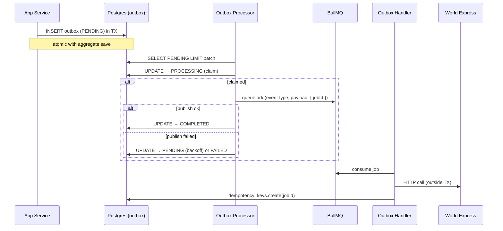


---

## 9. Domain Events & Event Publishing

Every aggregate records domain events via a private `recordThat(event)` and exposes `pullEvents()` / `peekEvents()`. Example from [`Product`](https://github.com/djaouad10/DDD-E-commerce-Backend/blob/main/src/domain/entities/product.ts):

```ts
this.recordThat(new ProductCreated(...));
this.recordThat(new VariationCreated(...));
this.recordThat(new StockReserved(...));
```

The application service drains them (`pullEvents()`) and persists them atomically with the aggregate.

**Diagram:**

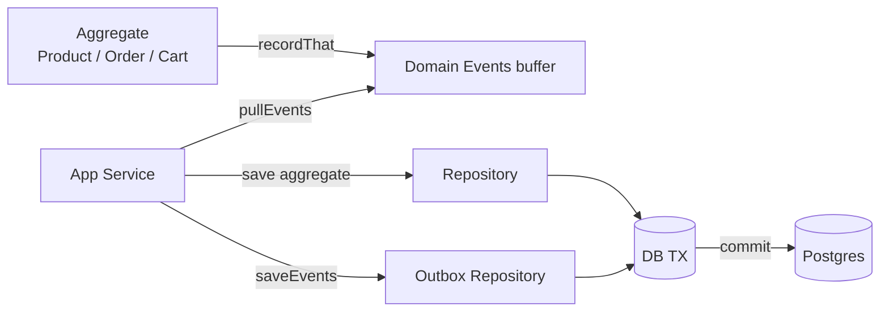

[`BullMqEventPublisher`](https://github.com/djaouad10/DDD-E-commerce-Backend/blob/main/src/infrastructure/messaging/bullmq/bullmq-event-publisher.ts) maps `DomainEventCode` → list of target queues using a `FlowProducer`:

```ts
const eventToQueuesMapper: Record<DomainEventCode, Queue[]> = {
  "order.created":    [emailQueue, inventoryQueue, analyticsQueue],
  "order.cancelled":  [emailQueue, inventoryQueue, analyticsQueue],
  "order.confirmed":  [emailQueue, analyticsQueue],
  ...
};
```

Each outbox row's `jobId` (the outbox row ID) is reused as the BullMQ `jobId`, so **duplicate publishing is a no-op** within BullMQ (same jobId ⇒ already exists).

Related files:

- Base type: [`src/domain/events/domain-event.ts`](https://github.com/djaouad10/DDD-E-commerce-Backend/blob/main/src/domain/events/domain-event.ts)
- Port: [`src/application/ports/messaging/event-publisher.port.ts`](https://github.com/djaouad10/DDD-E-commerce-Backend/blob/main/src/application/ports/messaging/event-publisher.port.ts)
- Adapter: [`src/infrastructure/messaging/bullmq/event-publisher.ts`](https://github.com/djaouad10/DDD-E-commerce-Backend/blob/main/src/infrastructure/messaging/bullmq/bullmq-event-publisher.ts)
- Processor service: [`src/application/services/domain-events-processor/domain-events-processor.service.ts`](https://github.com/djaouad10/DDD-E-commerce-Backend/blob/main/src/application/services/domain-events-processor/domain-events-processor.service.ts)

**Diagram:**

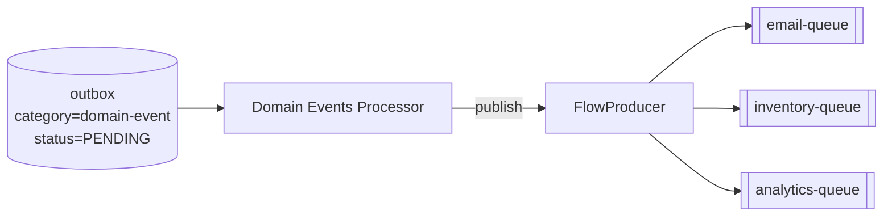

---

## 10. Idempotency & At-Least-Once Delivery

Two layers of idempotency:

### 1. HTTP idempotency (`idempotency_keys` table)

For `POST /api/v1/orders`, the client sends an `idempotencyKey` (UUID). Inside the transaction the service calls:

```ts
await this.idempotencyKeysRepository.create(
  idempotencyKey,
  "CreateOrderService",
  tx,
  { orderId: order.id.value },
);
```

If the key already exists, the unique constraint fires, but `CreateOrderService` **first checks** for an existing key and returns the stored `orderId` if present. This makes the entire endpoint safely retryable.

### 2. Worker idempotency (`idempotency_keys` table)

Email handler services use the same table with `jobId` as the key:

```ts
await this.db.transaction(async (tx) => {
  await this.idempotencyKeysRepository.create(jobId, "EmailQueueOrderConfirmedHandlerService", tx);
  await this.emailGateway.sendEmail(...);
});
```

If BullMQ redelivers the job, the unique constraint on `idempotency_keys.id` throws, the transaction rolls back, and no duplicate email is sent.

Combined with the outbox pattern, this yields **at-least-once delivery + exactly-once effect**.

Files:

- Port: [`src/application/ports/persistence/idempotency-keys.repository.port.ts`](https://github.com/djaouad10/DDD-E-commerce-Backend/blob/main/src/application/ports/persistence/idempotency-keys.repository.port.ts)
- Adapter: [`src/infrastructure/databases/repositories/postgres/postgres-idempotency-keys-repository.ts`](https://github.com/djaouad10/DDD-E-commerce-Backend/blob/main/src/infrastructure/databases/repositories/postgres/postgres-idempotency-keys-repository.ts)
- Table: `idempotency_keys` in [`schema.ts`](https://github.com/djaouad10/DDD-E-commerce-Backend/blob/main/src/infrastructure/databases/schema.ts)
- Example worker consumer: [`src/application/services/email-queue-handlers/email-queue-order-confirmed-handler.service.ts`](https://github.com/djaouad10/DDD-E-commerce-Backend/blob/main/src/application/services/email-queue-handlers/email-queue-order-confirmed-handler.service.ts)

**Diagram:**

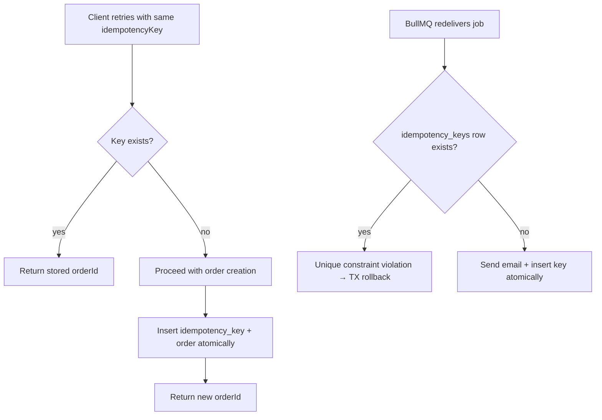


---

## 11. Concurrency Control (Optimistic Locking)

Aggregates that can be mutated concurrently (`Order`, `Product`) carry a `version` field. The repository enforces it:

```ts
const [updated] = await db
  .update(order)
  .set({ ...orderRow, version: sql`${orderRow.version} + 1` })
  .where(and(eq(order.id, orderRow.id), eq(order.version, orderAgg.getVersion())))
  .returning({ id: order.id });

if (!updated) {
  throw new ConflictError("order", orderAgg.id.value, "concurrent modification detected");
}
```

- The aggregate reads its current version from the row.
- On save, the WHERE clause requires `version = <previous>`.
- If another transaction updated in the meantime, 0 rows are affected and a `ConflictError` is thrown → mapped to **HTTP 409** at the API boundary.

Postgres error codes are also translated in [`handleDrizzleErrors`](https://github.com/djaouad10/DDD-E-commerce-Backend/blob/main/src/infrastructure/databases/errors/handle-drizzle-errors.ts):

| PG code | Mapped to |
|---|---|
| `23505` unique violation | `ConflictError` |
| `23503` foreign-key violation | `NotFoundError` |
| `23502` not-null violation | `ValidationError` |
| `40001` serialization failure | `ConflictError` ("retry") |
| `40P01` deadlock | `ConflictError` ("retry") |

Files:

- Domain side: [`src/domain/entities/order.ts`](https://github.com/djaouad10/DDD-E-commerce-Backend/blob/main/src/domain/entities/order.ts), [`src/domain/entities/product.ts`](https://github.com/djaouad10/DDD-E-commerce-Backend/blob/main/src/domain/entities/product.ts)
- Adapter side: [`src/infrastructure/databases/repositories/postgres/postgres-order-repository.ts`](https://github.com/djaouad10/DDD-E-commerce-Backend/blob/main/src/infrastructure/databases/repositories/postgres/postgres-order-repository.ts)

**Diagram:**

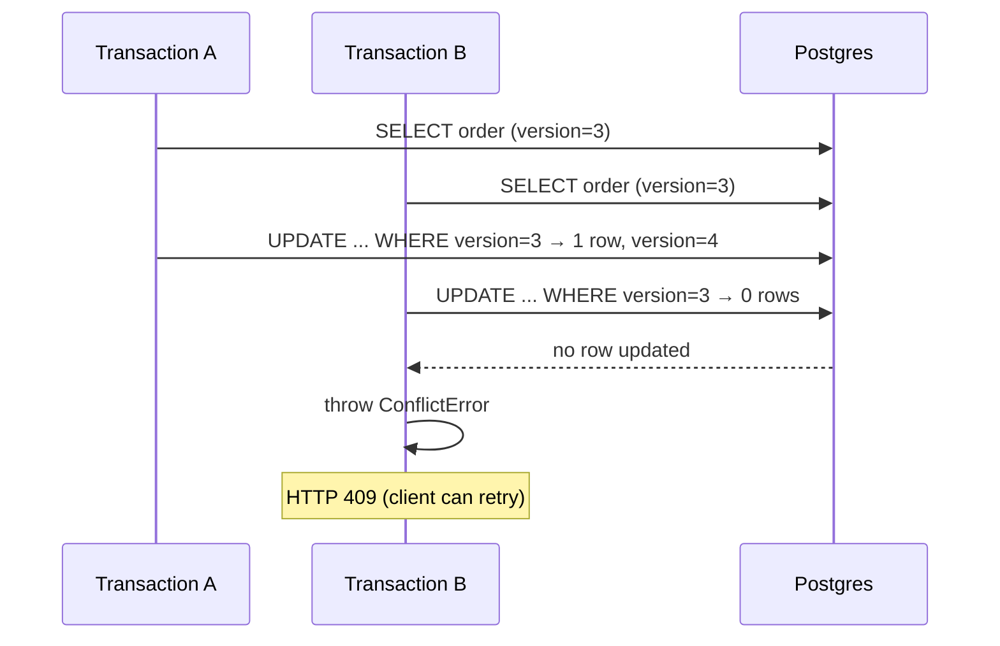


---

## 12. Error Handling Strategy

### Domain errors (operational)

`DomainError` is the base class for all business-facing errors, defined in [`src/shared/errors/errors.ts`](https://github.com/djaouad10/DDD-E-commerce-Backend/blob/main/src/shared/errors/errors.ts):

```ts
ValidationError        → 400  VALIDATION_ERROR
BadRequestError        → 400  BAD_REQUEST
UnauthorizedError      → 401  UNAUTHORIZED
ForbiddenError         → 403  FORBIDDEN
NotFoundError          → 404  NOT_FOUND
ConflictError          → 409  CONFLICT
InsufficientInventory  → 409  INSUFFICIENT_INVENTORY
```

These set `isOperational = true` and carry structured `details`. The error middleware ([`error-handling-middleware.ts`](https://github.com/djaouad10/DDD-E-commerce-Backend/blob/main/src/infrastructure/http/middleware/error-handling-middleware.ts)) maps them to user-friendly messages using a lookup table, with `{available}` placeholders interpolated from `details`.

### Infrastructure errors (programmer/unexpected)

```ts
DatabaseError               → 500
GatewayError                → 502
HttpTimeoutError            → 504
HttpConnectionError         → 502
HttpMalformedResponseError  → 502
DependencyResolutionError   → 500
```

`isOperational = false`, logged at error level with full stack + request context.

### Adapter-specific error translators

- [`handleDrizzleErrors`](https://github.com/djaouad10/DDD-E-commerce-Backend/blob/main/src/infrastructure/databases/errors/handle-drizzle-errors.ts)  Postgres/Drizzle → domain errors.
- [`handleWorldExpressErrors`](https://github.com/djaouad10/DDD-E-commerce-Backend/blob/main/src/infrastructure/gateways/errors/handle-world-express-errors.ts)  WorldExpress HTTP statuses → domain errors.
- [`handleUploadThingErrors`](https://github.com/djaouad10/DDD-E-commerce-Backend/blob/main/src/infrastructure/gateways/errors/handle-uploadthing-errors.ts)  UploadThing error codes → domain errors (see the gateway file below).

This keeps every adapter boundary **leak-free**: nothing past the adapter knows about Postgres codes, HTTP status codes, or SDK error shapes. `DependencyResolutionError` is thrown by the container on missing tokens (blog post [§9](https://www.djaouadgharbi.tech/blog/dependency-injection-from-scratch#9-iteration-1-a-map-andresolve-transient-only)).

**Diagram:**

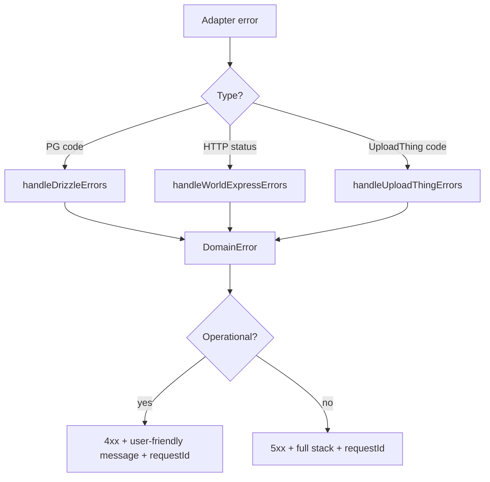

---

## 13. Observability: Logging & Context Propagation

### `AsyncLocalStorage` request context

[`src/shared/context/request-context.ts`](https://github.com/djaouad10/DDD-E-commerce-Backend/blob/main/src/shared/context/request-context.ts) exposes:

```ts
runWithContext(store, fn)
getContext()
getRequestId()
```

Every HTTP request and every worker job or worker poll cycle runs inside a context. `ContextStore` holds `requestId`, `userId`, `userRole`, `path`, `method`, `startTime`, `clientIp`, `jobId`, `queueName`.

### Structured logger

[`src/shared/logging/logger.ts`](https://github.com/djaouad10/DDD-E-commerce-Backend/blob/main/src/shared/logging/logger.ts) exports `Logger`, `createLogger`, `PerformanceTimer`, and a `measure(operation, fn)` wrapper that measures sync/async ops and logs `durationMs` automatically:

```ts
await this.logger.measure("db.query.order.findFirst", () => db.query.order.findFirst(...));
```

Every log line contains `level, message, timestamp, requestId, userId?, service, component, durationMs?, metadata?, error?`. JSON in production, pretty-printed in development.

`requestId` is echoed back to the client in the `x-request-id` response header (set by [`context-middleware.ts`](https://github.com/djaouad10/DDD-E-commerce-Backend/blob/main/src/infrastructure/http/middleware/context-middleware.ts)) so support tickets can be traced end-to-end.

---

## 14. Persistence & Read Models

### Write side — repositories + mappers

- Domain repositories ([`OrderRepository`](https://github.com/djaouad10/DDD-E-commerce-Backend/blob/main/src/domain/repositories/order.repository.ts), [`ProductRepository`](https://github.com/djaouad10/DDD-E-commerce-Backend/blob/main/src/domain/repositories/product.repository.ts), `CartRepository`, `UserRepository`, …) live in the domain layer.
- Postgres implementations live in [`src/infrastructure/databases/repositories/postgres/`](https://github.com/djaouad10/DDD-E-commerce-Backend/tree/main/src/infrastructure/databases/repositories/postgres).
- **Mappers** convert DB rows ↔ domain aggregates ([`PostgresOrderMapper`](https://github.com/djaouad10/DDD-E-commerce-Backend/blob/main/src/infrastructure/databases/mappers/postgres/postgres-order-mapper.ts)), so the domain never sees Drizzle types.
- [`handleDrizzleErrors`](https://github.com/djaouad10/DDD-E-commerce-Backend/blob/main/src/infrastructure/databases/errors/handle-drizzle-errors.ts) converts Postgres errors into domain errors at the repository boundary.

### Read side — read models

CQRS-lite: queries are **not** routed through aggregates. Application-layer `*Queries` contracts return **DTOs** shaped for specific consumers. Implementations live in [`src/infrastructure/databases/read-models/postgres`](https://github.com/djaouad10/DDD-E-commerce-Backend/tree/main/src/infrastructure/databases/read-models/postgres) and use Drizzle directly to build efficient projections (e.g., [`PostgresOrderQueries.search`](https://github.com/djaouad10/DDD-E-commerce-Backend/blob/main/src/infrastructure/databases/read-models/postgres/postgres-order-queries.ts) builds a composite cursor query with `(created_at, id)` tie-breaking).

Contracts: [`order.queries.ts`](https://github.com/djaouad10/DDD-E-commerce-Backend/blob/main/src/application/read-models/order.queries.ts), [`product.queries.ts`](https://github.com/djaouad10/DDD-E-commerce-Backend/blob/main/src/application/read-models/product.queries.ts), [`rating.queries.ts`](https://github.com/djaouad10/DDD-E-commerce-Backend/blob/main/src/application/read-models/rating.queries.ts).
DTOs: [`order.dto.ts`](https://github.com/djaouad10/DDD-E-commerce-Backend/blob/main/src/application/dto/order.dto.ts), [`product.dto.ts`](https://github.com/djaouad10/DDD-E-commerce-Backend/blob/main/src/application/dto/product.dto.ts), [`variation.dto.ts`](https://github.com/djaouad10/DDD-E-commerce-Backend/blob/main/src/application/dto/variation.dto.ts), [`cart.dto.ts`](https://github.com/djaouad10/DDD-E-commerce-Backend/blob/main/src/application/dto/cart.dto.ts), [`rating.dto.ts`](https://github.com/djaouad10/DDD-E-commerce-Backend/blob/main/src/application/dto/rating.dto.ts), [`category.dto.ts`](https://github.com/djaouad10/DDD-E-commerce-Backend/blob/main/src/application/dto/category.dto.ts), [`file.dto.ts`](https://github.com/djaouad10/DDD-E-commerce-Backend/blob/main/src/application/dto/file.dto.ts).

### Key tables

`user`, `session`, `account`, `verification`, `category`, `file`, `product`, `variation`, `cart_item`, `order`, `order_item`, `rating`, `outbox`, `idempotency_keys`, all defined in [`src/infrastructure/databases/schema.ts`](https://github.com/djaouad10/DDD-E-commerce-Backend/blob/main/src/infrastructure/databases/schema.ts).

The `outbox` table is indexed on `(category, status, scheduledAt)`, the exact shape every processor worker polls.

---

## 15. Testing Strategy

The full write-up is in the blog post: [Part VIII — Testing: The Registration Matrix](https://www.djaouadgharbi.tech/blog/dependency-injection-from-scratch#part-viii-testing-the-registration-matrix), including the token-vs-registration matrix in [§25](https://www.djaouadgharbi.tech/blog/dependency-injection-from-scratch#25-the-matrix-on-one-table).

### Unit tests

- Aggregates are tested exhaustively (see the `Order` suite: factory, reconstitute, every state transition, invalid transitions, totals, weights).
- All repositories and gateways have **in-memory implementations** so services can be tested without a DB.
- The DI container supports a unit-test composition root that wires in-memory adapters.

### Integration tests

Two DI composition roots for integration tests:

1. **Real DB + fake auth + fake gateways**, used by default.
2. **Real DB + real gateways, overridden per test**, e.g., the shipping gateway is replaced with `createFakeShippingProviderGateway()` to assert calls like `expect(fakeGateway.getDeliveryFeesOfWilaya).toHaveBeenCalledWith(16)`.

The per-test override rides on the last-write-wins re-registration rule from the blog post [§26](https://www.djaouadgharbi.tech/blog/dependency-injection-from-scratch#26-re-registration-as-the-override-mechanism):

```ts
beforeEach(async () => {
  await clearDatabase(container);
  fakeGateway = createFakeShippingProviderGateway();
  container.register(SHIPPING_PROVIDER_GATEWAY, () => fakeGateway, "scoped");
});
```

Integration tests target **endpoints** (via Supertest), not services directly, and assert:

- **Response validation** (HTTP shape, status codes, Zod errors).
- **Business logic validation** (banned user → 403, empty cart → 400, price mismatch → 400, …).
- **New state validation** (order created in DB, cart cleared, stock reserved).
- **Event persistence** (outbox contains `OrderCreated`, `CartCleared`, `StockReserved` in the same transaction).
- **Idempotency** (same idempotency key → same orderId).
- **Edge cases** (discounted products captured in order items).

Test helpers: [`src/tests/helpers/db-helpers.ts`](https://github.com/djaouad10/DDD-E-commerce-Backend/blob/main/src/tests/helpers/db-helpers.ts), [`src/tests/helpers/domain-helpers.ts`](https://github.com/djaouad10/DDD-E-commerce-Backend/blob/main/src/tests/helpers/domain-helpers.ts), [`src/tests/helpers/test-app.ts`](https://github.com/djaouad10/DDD-E-commerce-Backend/blob/main/src/tests/helpers/test-app.ts), [`src/tests/helpers/auth-helpers.ts`](https://github.com/djaouad10/DDD-E-commerce-Backend/blob/main/src/tests/helpers/auth-helpers.ts), [`src/tests/helpers/fake-shipping-gateway.ts`](https://github.com/djaouad10/DDD-E-commerce-Backend/blob/main/src/tests/helpers/fake-shipping-gateway.ts), [`src/tests/helpers/outbox-assertions.ts`](https://github.com/djaouad10/DDD-E-commerce-Backend/blob/main/src/tests/helpers/outbox-assertions.ts).

Worker services and workers also get integration tests, with `runIteration()` called directly to avoid infinite loops.

---

## 16. CI/CD Pipeline

### `ci.yml` — on every pull request to `main`

[`.github/workflows/ci.yml`](https://github.com/djaouad10/DDD-E-commerce-Backend/blob/main/.github/workflows/ci.yaml)

```
┌──────────────────┐  ┌──────────────┐  ┌─────────────────────┐
│ Lint & Typecheck │  │ Unit Tests   │  │ Integration Tests   │
│  tsc --noEmit    │  │ vitest unit  │  │ .env.test + vitest  │
│  npm run lint    │  │              │  │  integration        │
└──────────────────┘  └──────────────┘  └─────────────────────┘
┌──────────────────┐  ┌──────────────────────────────────────┐
│ Dependency Audit │  │ CodeQL (javascript-typescript)       │
│ npm audit --omit │  │                                      │
└──────────────────┘  └──────────────────────────────────────┘
```

- **Concurrency group** per PR with `cancel-in-progress: true`.
- Integration job provisions ephemeral `.env.test` (Postgres on `5433`, Redis on `6380`) so tests run against real infrastructure.
- `npm audit --audit-level=high --omit=dev` fails the build on high-severity runtime vulns.
- CodeQL scans for security issues.


### `cd.yml` — on push to `main`

[`.github/workflows/cd.yml`](https://github.com/djaouad10/DDD-E-commerce-Backend/blob/main/.github/workflows/cd.yaml)

```
checkout → login to GHCR → setup buildx → docker build & push
  tags:
    ghcr.io/djaouad10/ddd-e-commerce-backend:latest
    ghcr.io/djaouad10/ddd-e-commerce-backend:${{ github.sha }}
  cache: gha (mode=max)
```

- Uses GitHub Actions cache for layer caching.
- Both `latest` and immutable SHA tags pushed.
- A **Coolify webhook trigger** step is stubbed (commented out) for one-command deploys.

### [`docker-compose.prod.yaml`](https://github.com/djaouad10/DDD-E-commerce-Backend/blob/main/docker-compose.prod.yaml)

One image, seven services, each with a different `command`. The API has a TCP-based healthcheck (connect to port 3000). All services share `x-service-defaults` (restart, env file, JSON log rotation).

**Diagram:**

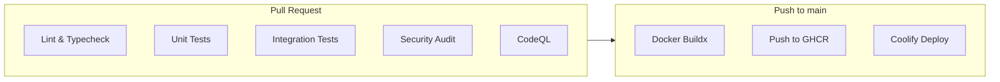


---
## Appendix A — Key Files & Directories

```
src/
├── entrypoints/
│   ├── api/index.ts                      # API bootstrap
│   └── workers/
│       ├── outbox-handler.ts
│       ├── email-queue-handler.ts
│       ├── outbox-processor.ts
│       ├── domain-events-processor.ts
│       ├── clean-outbox.ts
│       └── reset-stuck-outbox-rows.ts
├── composition/
│   ├── roots/                            # one per process
│   │   ├── api.composition.ts
│   │   ├── outbox-handler.composition.ts
│   │   ├── email-queue-handler.composition.ts
│   │   ├── outbox-processor.composition.ts
│   │   ├── domain-events-processor.composition.ts
│   │   ├── clean-outbox-worker.composition.ts
│   │   └── reset-stuck-outbox-rows-worker.composition.ts
│   └── utils/
│       ├── container.ts                  # manual DI container
│       ├── tokens.ts                     # injection tokens
│       └── shared-registry.ts            # DB, Redis singletons
├── domain/
│   ├── entities/                         # Order, Product, User, Cart, ...
│   ├── value-objects/                    # Money, OrderId, ShippingDetails, ...
│   ├── entities-snapshots/               # toSnapshot() shapes
│   ├── events/                           # DomainEvent + concrete events
│   ├── repositories/                     # port interfaces
│   ├── gateways/                         # port interfaces
│   └── services/
├── application/
│   ├── services/                         # read + mutation services
│   ├── commands/                         # command objects (self-validating)
│   ├── queries/                          # query objects (self-validating)
│   ├── dto/                              # response shapes
│   ├── read-models/                      # query contracts
│   └── ports/                            # Outbox, Idempotency, EventPublisher, Auth
├── infrastructure/
│   ├── config/                           # env, db, redis
│   ├── http/
│   │   ├── server/                       # createServer
│   │   ├── middleware/                   # scope, context, attachUser, logger, errors
│   │   └── routes/
│   ├── databases/
│   │   ├── schema.ts                     # Drizzle schema
│   │   ├── repositories/postgres/        # repo implementations
│   │   ├── queries/postgres/             # read-model implementations
│   │   ├── mappers/postgres/             # row ↔ domain
│   │   └── errors/handle-drizzle-errors.ts
│   ├── messaging/
│   │   ├── bullmq/
│   │   │   ├── workers/                  # consumer + cron workers
│   │   │   ├── queue/                    # queue factories
│   │   │   └── event-publisher.ts        # BullMqEventPublisher
│   │   └── jobs/                         # payload schemas + registries
│   ├── gateways/
│   │   ├── world-express.gateway.ts
│   │   ├── brevo-email.gateway.ts
│   │   ├── uploadthing.gateway.ts
│   │   └── errors/
│   ├── http/client/http-client.ts        # FetchHttpClient
│   ├── notifications/templates/
│   └── upload/uploadthing.ts
├── shared/
│   ├── errors/errors.ts                  # DomainError hierarchy
│   ├── logging/logger.ts                 # structured logger
│   ├── context/request-context.ts        # AsyncLocalStorage
│   ├── utils/
│   └── types/
└── tests/
    ├── helpers/                          # db-helpers, auth-helpers, fakes
    └── integration/
```

Direct links to the key files above:

- Composition: [`container.ts`](https://github.com/djaouad10/DDD-E-commerce-Backend/blob/main/src/composition/utils/container.ts) · [`tokens.ts`](https://github.com/djaouad10/DDD-E-commerce-Backend/blob/main/src/composition/utils/tokens.ts) · [`shared-registry.ts`](https://github.com/djaouad10/DDD-E-commerce-Backend/blob/main/src/composition/utils/shared-registry.ts)
- Domain errors: [`errors.ts`](https://github.com/djaouad10/DDD-E-commerce-Backend/blob/main/src/shared/errors/errors.ts)
- Logger: [`logger.ts`](https://github.com/djaouad10/DDD-E-commerce-Backend/blob/main/src/shared/logging/logger.ts)
- Request context: [`request-context.ts`](https://github.com/djaouad10/DDD-E-commerce-Backend/blob/main/src/shared/context/request-context.ts)
- Drizzle schema: [`schema.ts`](https://github.com/djaouad10/DDD-E-commerce-Backend/blob/main/src/infrastructure/databases/schema.ts)
- Drizzle error handler: [`handle-drizzle-errors.ts`](https://github.com/djaouad10/DDD-E-commerce-Backend/blob/main/src/infrastructure/databases/errors/handle-drizzle-errors.ts)
- WorldExpress error handler: [`handle-world-express-errors.ts`](https://github.com/djaouad10/DDD-E-commerce-Backend/blob/main/src/infrastructure/gateways/errors/handle-world-express-errors.ts)
- HTTP client: [`http-client.ts`](https://github.com/djaouad10/DDD-E-commerce-Backend/blob/main/src/infrastructure/http/client/http-client.ts)
- Event publisher: [`event-publisher.ts`](https://github.com/djaouad10/DDD-E-commerce-Backend/blob/main/src/infrastructure/messaging/bullmq/bullmq-event-publisher.ts)
- BullMQ worker entry: [`outbox-handler.worker.ts`](https://github.com/djaouad10/DDD-E-commerce-Backend/blob/main/src/infrastructure/messaging/bullmq/workers/outbox-handler.worker.ts) · [`email-queue-handler.worker.ts`](https://github.com/djaouad10/DDD-E-commerce-Backend/blob/main/src/infrastructure/messaging/bullmq/workers/email-queue-handler.worker.ts)
- Cron workers: [`outbox-processor.worker.ts`](https://github.com/djaouad10/DDD-E-commerce-Backend/blob/main/src/infrastructure/messaging/bullmq/workers/outbox-processor.worker.ts) · [`domain-events-processor.worker.ts`](https://github.com/djaouad10/DDD-E-commerce-Backend/blob/main/src/infrastructure/messaging/bullmq/workers/domain-events-processor.worker.ts) · [`clean-outbox.worker.ts`](https://github.com/djaouad10/DDD-E-commerce-Backend/blob/main/src/infrastructure/messaging/bullmq/workers/clean-outbox.worker.ts) · [`reset-stuck-outbox-rows.worker.ts`](https://github.com/djaouad10/DDD-E-commerce-Backend/blob/main/src/infrastructure/messaging/bullmq/workers/reset-stuck-outbox-rows.worker.ts)
- Outbox port + adapter: [`outbox.repository.port.ts`](https://github.com/djaouad10/DDD-E-commerce-Backend/blob/main/src/application/ports/persistence/outbox.repository.port.ts) · [`postgres-outbox-repository.ts`](https://github.com/djaouad10/DDD-E-commerce-Backend/blob/main/src/infrastructure/databases/repositories/postgres/postgres-outbox-repository.ts)
- Order service: [`create-order.service.ts`](https://github.com/djaouad10/DDD-E-commerce-Backend/blob/main/src/application/services/order/create-order.service.ts) · [`cancel-order.service.ts`](https://github.com/djaouad10/DDD-E-commerce-Backend/blob/main/src/application/services/order/cancel-order.service.ts)
- Order repository (optimistic locking): [`postgres-order-repository.ts`](https://github.com/djaouad10/DDD-E-commerce-Backend/blob/main/src/infrastructure/databases/repositories/postgres/postgres-order-repository.ts)
- Order mapper: [`postgres-order-mapper.ts`](https://github.com/djaouad10/DDD-E-commerce-Backend/blob/main/src/infrastructure/databases/mappers/postgres/postgres-order-mapper.ts)
- Order read model: [`postgres-order-queries.ts`](https://github.com/djaouad10/DDD-E-commerce-Backend/blob/main/src/infrastructure/databases/queries/postgres/postgres-order-queries.ts)

---

## Appendix B — Design Principles Recap

1. **Every process is isolated**: own entry point, own composition root, own scope lifecycle. See the blog post: [Part V — Composition Roots and the Object Graph Per Process](https://www.djaouadgharbi.tech/blog/dependency-injection-from-scratch#part-v-composition-roots-and-the-object-graph-per-process).
2. **Dependency rule is enforced**: domain knows nothing; application knows domain; infrastructure knows both. See [§6 Onion Architecture](https://www.djaouadgharbi.tech/blog/dependency-injection-from-scratch#6-onion-architecture--dip-applied-to-the-layer-graph).
3. **Aggregates are the only write boundary**: repositories save them, services orchestrate, events describe what happened.
4. **No external I/O inside a DB transaction**: the outbox table is the only bridge.
5. **Every consumer is idempotent**: the `idempotency_keys` table makes at-least-once delivery safe.
6. **Concurrency is explicit**: `version` columns + `ConflictError` + HTTP 409.
7. **Adapters translate errors**: nothing past the adapter boundary knows about Postgres codes or HTTP statuses.
8. **Observability is ambient**: `AsyncLocalStorage` + structured logger means every log line carries `requestId`, `userId`, and duration.
9. **Testability is a first-class concern**: integration + unit tests composition roots, in-memory adapters, fake gateways, per-endpoint integration tests, and `runIteration()` exposure on workers. See [Part VIII — Testing: The Registration Matrix](https://www.djaouadgharbi.tech/blog/dependency-injection-from-scratch#part-viii-testing-the-registration-matrix).

---

### Companion reading

- Blog: [*Dependency Injection from Scratch: Building a DI Container for a DDD TypeScript Backend*](https://www.djaouadgharbi.tech/blog/dependency-injection-from-scratch)
 